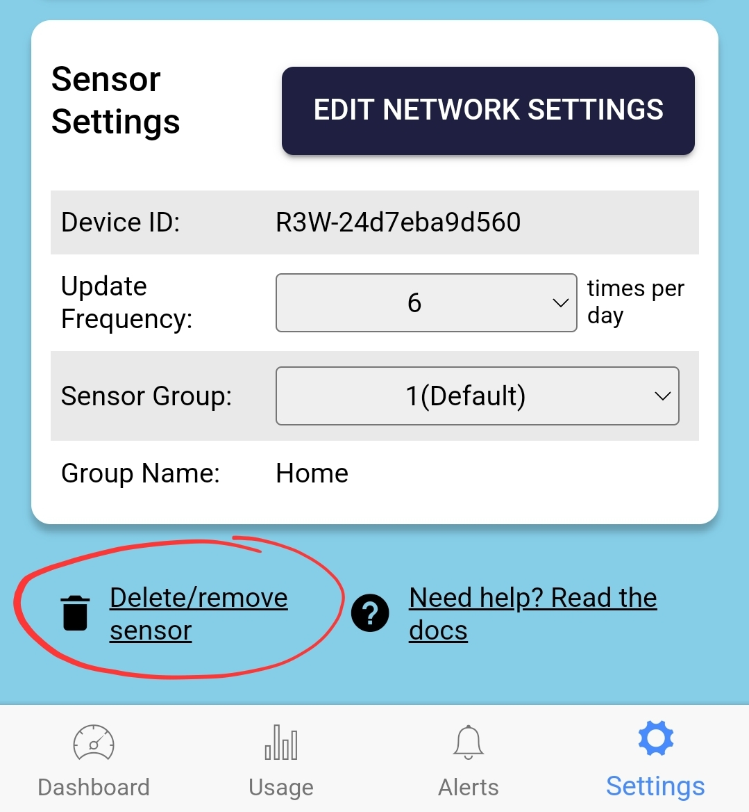

# Changing a TankMate Sensor

If your TankMate sensor has been **swapped**, or your **main control board** has been upgraded - follow the steps below to update your account via the mobile app:

### 1) Note down your current tank settings

* In the app, go to **Settings > Sensor / Tank Settings**
* If you have **more than one sensor**, select the **one you want to remove** from the drop down list
* Take a note of the following, to make it easier to set up the new sensor:
  * Overflow height
  * Outlet height
  * Volume (or diameter)
  * Sensor height (R3 sensors ony)

### 2) Delete the current sensor unit

* In the app, go to **Settings > Sensor / Tank Settings**
* Scroll down until you see "**Delete / Remove Sensor**" option
* Confirm sensor deletion&#x20;

<figure><figcaption></figcaption></figure>

### 3) Add a New Sensor

* From the homse screen, select the correct sensor type
* Follow the prompts in the app to add the new sensor
* Enter the same tank dimension values as the previous sensor
* Save your settings
