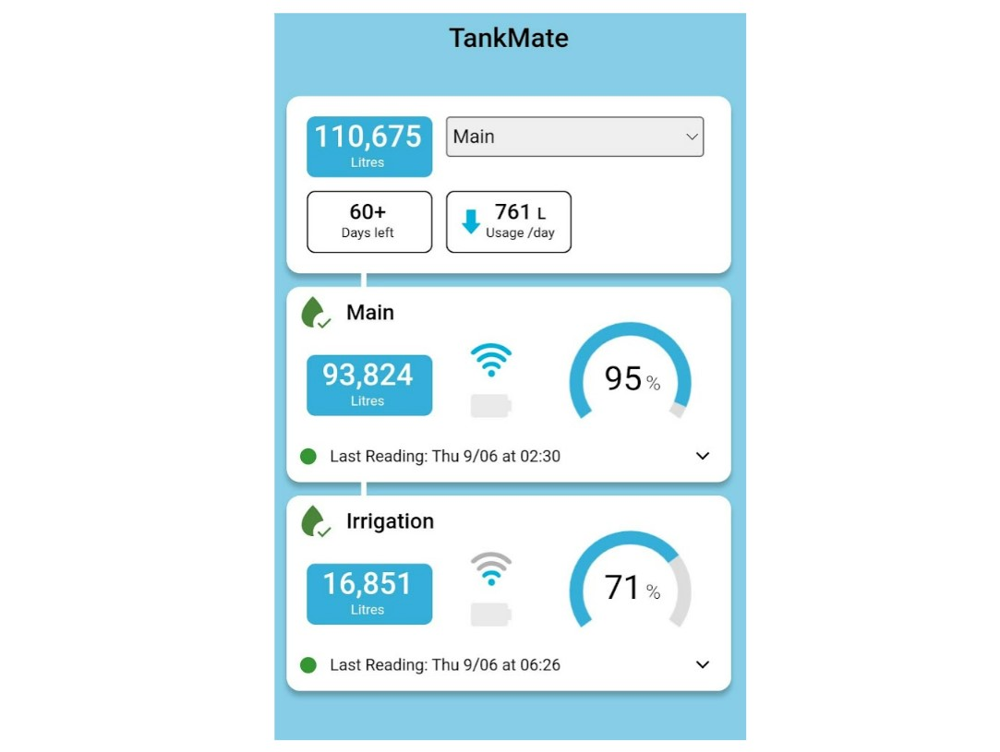
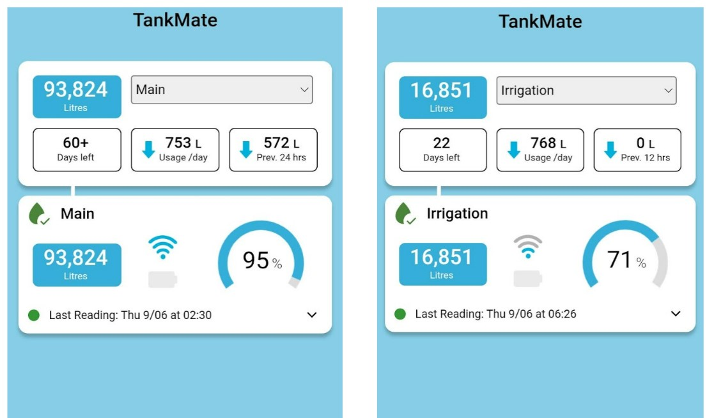

# Multiple Sensors

The TankMate app allows users with multiple sensors to choose how their tank data is displayed. Individual sensors can be:

* **Grouped together:** so that a total system volume is displayed for multiple sensors. Usage data can also be viewed as part of a combined system. Use this approach if you have two tanks that feed the same system (e.g. a property with a single pump that draws from two separate tanks (each with a sensor)

* **Placed in different "tank groups"**: so that each sensor is treated as a completely unique system. None of the tank / usage data is combined. Use this approach when monitoring two separate tank systems e.g. tanks on two different properties.&#x20;

### To change a sensor group

* In the mobile app, go to **Settings** > **Sensor / Tank Settings**
* Select the sensor you want to edit, e.g. "Sensor 1" - from the top menu .jpg>)
* Scroll down to the **Sensor Settings**&#x20;
* Select the "**Sensor Group"** (from the drop down menu) that you want to **add** the sensor to
* **SAVE** the settings for the sensor - at the top of the screen
* Repeat for any other sensors you want to modify


**Note**: for sensors set up with previous app versions, the sensor may have been placed in a "**default**" group, and may not display correctly.&#x20;

To resolve this, **assign each of the sensors to a new group** - e.g. assign both to **Group 2** - which will resolve the display issue. After this, you can re-assign the sensors as required.


### To edit a group name

* In the mobile app, go to **Settings** > **Group Settings**
* Edit the name of the Group
* **SAVE** the settings
