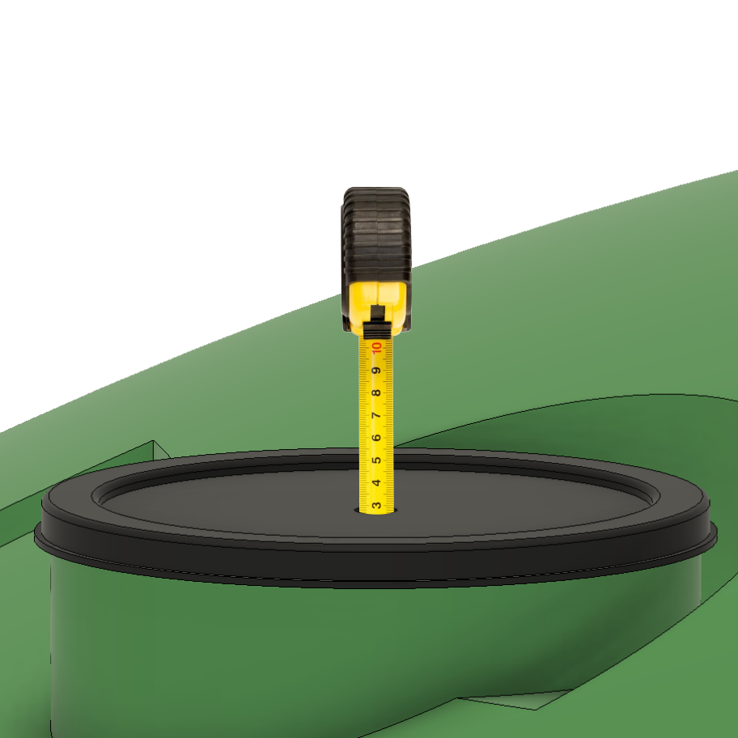

# Tank Dimension Settings

To correctly configure the tank dimensions for a TankMate level sensor, the following settings need to be configured in the mobile app:

**Sensor Height (h)** - required only for **TankMate R3 sensors**. This is the height from the **bottom of the tank to the base of the sensor**. The easiest way to measure this is with a tape measure - after the hole has been drilled, as shown below. Unit: **metres**

**Overflow Height (h2)** - this will set the maximum fill level (100% level) for the tank. If you have an in-ground tank and the overflow pipe is difficult to locate, you can measure the height from the tank floor to the underside of the tank roof. Subtract 100mm from this measurement to estimate the overflow height. Unit: **metres**


If your sensor is **regularly reporting levels above 100%** - you have most likely set the Overflow Height **too high**. Reduce this value.

Note: an incorrect Sensor Height setting can also cause innacurate height measurements



Tank levels will **exceed the overflow height during heavy rainfall events**. Since most tanks use a horizontal outplet pipe (100-150mm dia.) - it is not uncommon for a tank level to be 50mm (or more) **above** the oveflow height for short periods of time.&#x20;


**Outlet Height (h1)** - this will set the **minimum level** (0% level) for the tank. With a moulded plastic tank, the outlet is usually around 100mm above the base of the tank. For tanks with submersible pumps, set this value slightly higher. Unit: **millimetres**

**Tank Diameter (d)** - this will set the volume of the tank. Note that in the mobile app there are three ways to define the tank volume: 1) volume (Litres), 2) diameter. Unit: **metres**

&#x20;
