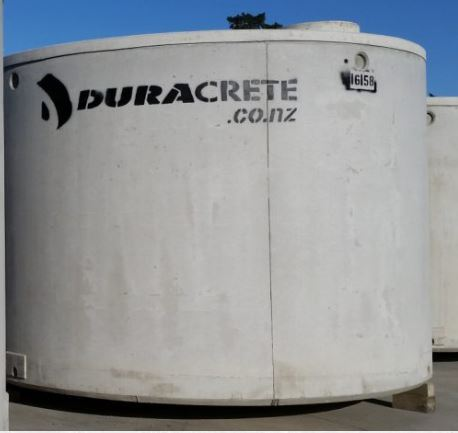

# Typical Tank Dimensions

### Aqua Tanks 

Volume: 25,000L | Diameter: 3.545m | Overflow: 2.5m

Volume: 30,000L | Diameter: 3.750m | Overflow: 2.7m

### Devan 

Volume: 25,000L | Diameter: 3.5m | Overflow: 2.5m

Volume: 30,000L | Diameter: 3.7m | Overflow: 2.7m

### Duracrete Standard 

Volume: 25,000L | Diameter: 3.6m | Overflow: 2.4m

### KP Concrete 

Volume: 22,500L | Diameter: 3.62m | Overflow: 2.15m
