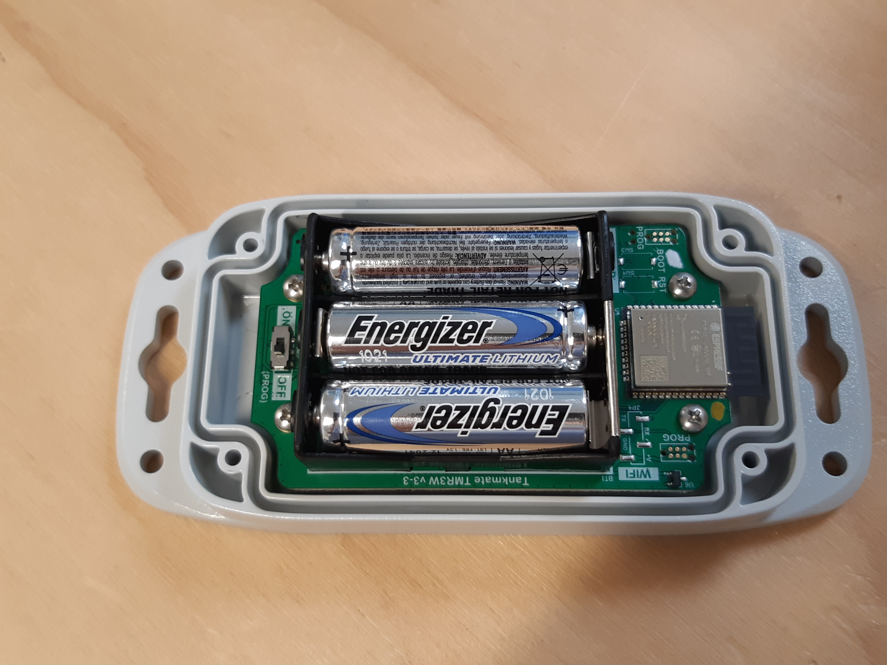

# Check the status of an LTE Sensor

### Check device connectivity with the status LED

* Remove the **four fixing screws** (#2 Philips) that secure the sensor to the tank
* Lift the sensor up from the tank
* **Press** the **READ button** on the underside of the sensor unit, and check the status LED


The status **LED** and **buzzer** should follow this sequence:

* blinking <mark style="color:green;">**GREEN**</mark> (connecting to cellular network)&#x20;
* blinking <mark style="color:blue;">**BLUE**</mark> + single **beep** (connecting to the server)
* solid <mark style="color:blue;">**BLUE**</mark> + single **beep** (successful connection to the server)
* blinking <mark style="color:orange;">**ORANGE**</mark> + short **beep** **x 10** (delay before the sensor reads) -> place the sensor back down on the tank to take a tank level reading



If the sensor blinks <mark style="color:red;">**RED**</mark> after trying to connect - this indicates that the network connection was **not successful**



If **NO LED** light is seen: open the sensor unit (see below) and check the batteries


<figure><figcaption></figcaption></figure>

### Opening the R3 LTE Sensor Enclosure

* Remove the **four M4 machine screws** (#1 Philips) that secure the enclosure lid to the base
* Carefully seperate the lid from the base


**Take care when lifting the lid** - as the internal **antenna** is attached to the underside of the enclosure lid. Do not pull or twist the antenna cable.


* **Turn the unit off** using the slide switch&#x20;
* **Remove one** of the **batteries for 1 minute** - to perform a hard reset on the sensor unit
* If possible, check the battery **cell voltage** with a **multimeter**. It should be **above 1.2V** &#x20;
* Return the battery (if good) and turn the unit **ON**. Press the **READ** button under the unit

<figure><figcaption></figcaption></figure>
