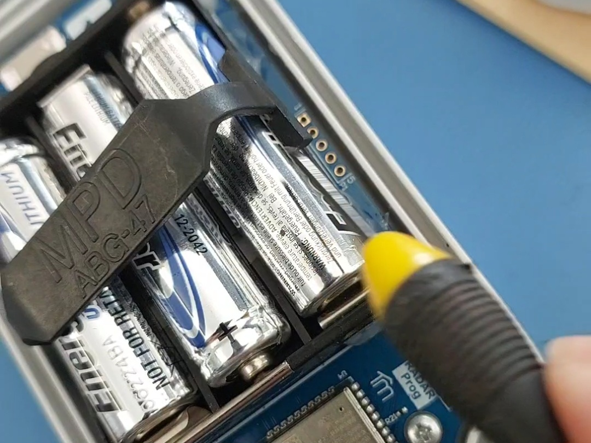

# R3 Battery Replacement

The TankMate R3L and R3W sensors use **3xAA batteries** - Energizer Ultimate Lithium recommended. The sensor has an built in battery monitor to provide battery information through the mobile app. You can see the battery status from the main dashboard screen.

**To replace the batteries:**

* Unscrew the 4 fixing screws that hold the sensor in place
* Turn the unit over, and remove the 4 machine screws underneath the unit&#x20;
* Separate the lid from the enclosure base&#x20;


For cellular sensors - remove the lid carefully to avoid detaching the antenna cable


* Turn the sensor off (small slide switch). Remove the old batteries
* If a battery clip is fitted - remove this by releasing the sides of the clip with a flat screwdriver
* Insert the new batteries, and turn the sensor back on
* Put the lid back on, and replace the 4 machine screws - do not overtighten


When at the tank, **press the READ button** once to wake the sensor up. After the orange light starts blinking (and beeping once per second), place the sensor back on the tank.


* Fasten the sensor back down onto the tank. Ensure that the lens and o-ring are in place, and there is no moisture between the lens and the sensor base.


The TankMate battery monitor is calibrated for **Energizer Ultimate Lithium** batteries.&#x20;

**Note:** Using any **alkaline battery** type will work, however the battery life estimates in the app may not be accurate. The app will show a **half full battery icon** after new alkaline cells are inserted.



**Do not** use '**heavy duty**' type cells in any TankMate sensor


<figure><figcaption>
Battery clip removal
</figcaption></figure>

