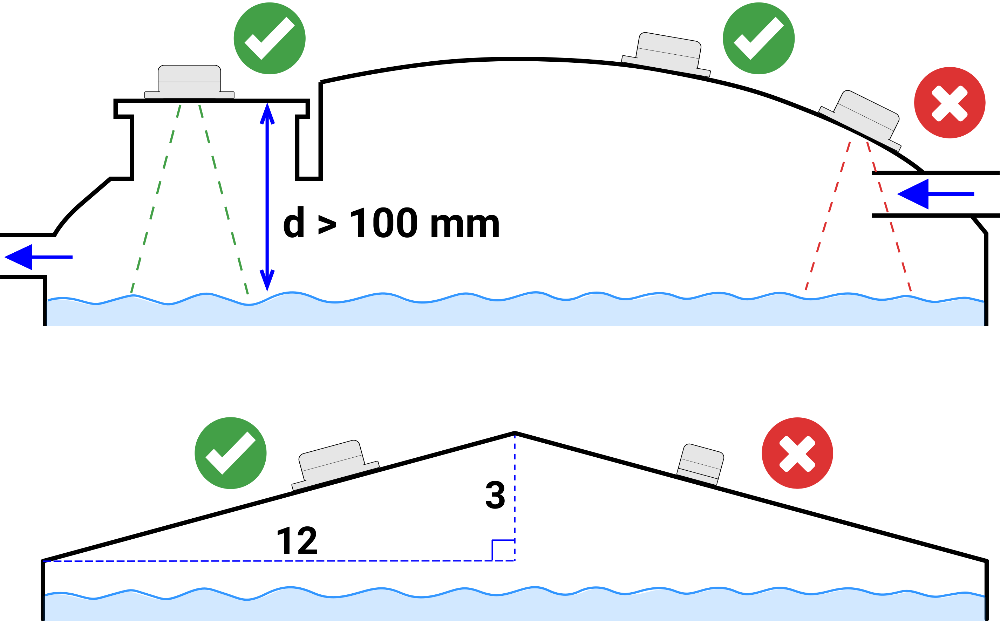
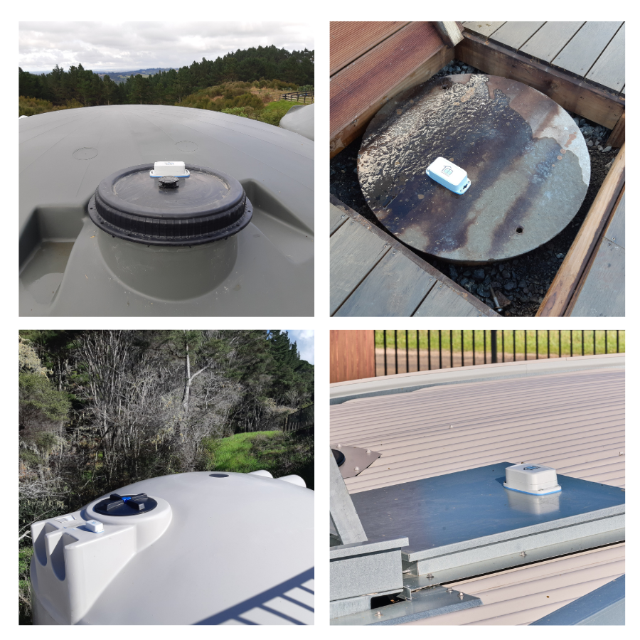

# Sensor Installation

### Positioning the TankMate Sensor

A TankMate R3 sensor needs to be installed on top of the tank, above the water surface. It should:

* be at least **100mm above** the tank overflow height (maximum level)
* have a **clear line-of-sight** down to the water, with no obstructions
* if possible, avoid inlet pipes that can create surface turbulance
* **not** be on a slope greater than **3/12** (15 degrees). Orientate the sensor so that the long edge runs up the slope

<figure><figcaption>
Positioning a TankMate sensor.
</figcaption></figure>


Some polypropylene tanks may have **internal metal support structures** built into the tank. These may join in the center of the tank, and will create false readings when the sensor is mounted on the center of the tank roof.

Contact your tank manufacturer if you are unsure.


### Tank Preparation

* Drill a **hole** for the sensor - it should be between **30mm and 35mm in diameter**&#x20;
* Place the **blue rubber gasket** onto the tank lid/roof - **align the center hole** with the hole you have drilled
* **Mark the position** of the 4 fixing holes, then remove the rubber gasket&#x20;
* Drill the 4 **fixing holes**: **3mm** for poly or steel tanks, or **6mm** for concrete
* Measure the height from the hole to the floor of the tank


**Don't fix the sensor in position just yet!** Make sure it is connected, and that some **intial readings** have been reported in the app before securing with the fixing screws



For **thicker** tank materials (e.g. concrete), ensure that the hole is **drilled vertically** - so the sensor has a direct line-of-sight down the water


<figure><figcaption></figcaption></figure>

<figure><figcaption>
Use the gasket as a template for the fixing screw locations
</figcaption></figure>

<figure><figcaption>
Sensor height measurement
</figcaption></figure>

<figure><figcaption></figcaption></figure>
