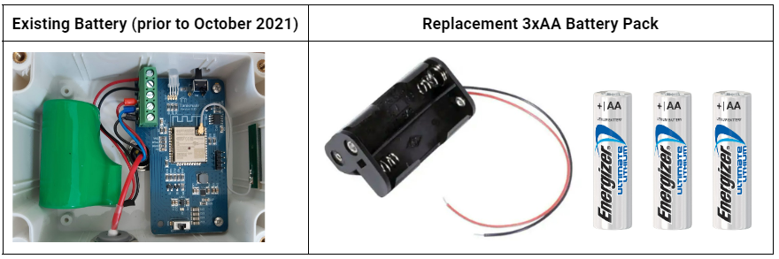

# v2 Battery Replacement


Prior to October 2021, TankMate v2 sensors were supplied with a single C size, 3.6V lithium battery. These can be hard to source, and there are a variety of similar batteries that do not work in a TankMate sensor. **We recommend installing the AA battery adapter** - [sold here](https://tankmate.co.nz/collections/accessories/products/replacement-battery-pack?variant=40113642504398).



Note: the following battery types **will not be suitable** to power a TankMate unit

* **Heavy duty** type cells&#x20;
* A single **1.5V C-size** cell&#x20;
* **ER26500** C-size lithium


**Tools required:** Phillips / Pozi screwdriver #2; Flat screwdriver #1

**Recommended AA Batteries:  Energizer Ultimate Lithium L91 (AA size, 1.5v)** / or Alkaline type


Models with a v2.60 PCB use a plug in connector for the battery, and do not have screw terminals


1. Open the sender unit - remove the 4 x screws on the lid&#x20;
2. Turn the unit OFF, using the slide switch&#x20;
3. Remove the existing C-size lithium battery&#x20;
4. \*If your unit has a plug in connector (v2.60) - pull out the existing battery plug (with pliers) and insert the plug for the new 3 x AA battery pack. Skip steps 5-8.&#x20;
5. Undo the two screw terminals (marked 1 and 2 below) and remove the existing battery leads&#x20;
6. If present - remove the C-size battery holder - held down with double sided tape&#x20;
7. Insert the leads for the new 3 x AA battery pack. The wiring should match the image below:     1. RED || 2. BLACK&#x20;
8. Tighten the screw terminals&#x20;
9. Insert the 3 x AA cells&#x20;
10. Power the unit ON (check status LED). If the LED does not blink, check the battery connections&#x20;
11. Close the lid, ensuring the seal is in place. Replace and tighten the 4 x screws

.png>)
