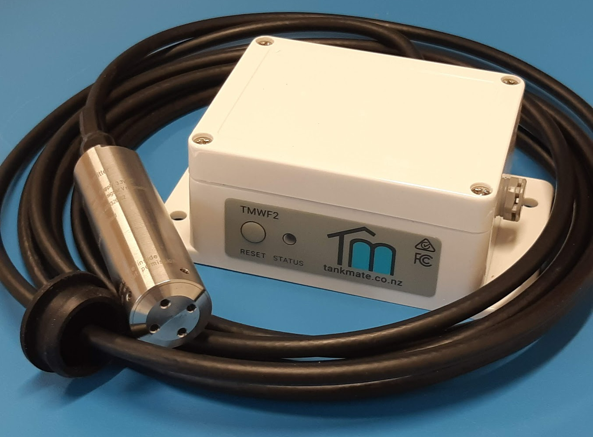

# Troubleshooting - FAQ

### New Sensors - Setup Issues

For assistance with setting up a new sensor, see here for[ R3L sensor ](tankmate-user-guide/tankmate-r3-lte-cellular-sensors/set-up-a-new-r3l-lte-cellular-sensor.md)/ or here for the [R3W sensor](tankmate-user-guide/tankmate-wifi-sensors/tankmate-r3-wifi-sensors/set-up-a-new-r3w-wifi-sensor/)

### TankMate App / Account

My app has not show any updated readings for a while. What should I do?

On the main dashboard screen of the app - swipe down to refresh the data. If the **last reading date/time** was more than 24 hours ago, you may  or the network connection. Common causes include:

* An issue with the **WiFi network** (router turned off, new network name / password), or a service issue with the cellular network (R3L sensors)&#x20;
* Low battery on the sensor
* WiFi credentials cleared / lost
* For WiFi sensors - [check the status of a sensor unit](wi-fi-connectivity/check-status-v2-and-r3w-wifi-sensors.md)
* For R3L cellular (LTE) sensors - [see here](tankmate-user-guide/tankmate-r3-lte-cellular-sensors/hardware-status-r3l-cellular-lte-sensor.md)

I can log into the app, but no sensor is listed <strong>and no data is shown</strong> - the app prompts me to add a new sensor. Why?

This usually indicates that:

* You may have **created a second account** - in the app, go to **Settings > Account** and check which email you have signed in with.  If in doubt, log out, and try log in with a different email address!
* Or - the sensor has actually been **deleted from your account** at some point - accessed via the Settings > Sensor / Tank Settings screen. You can add the sensor to your account again from the "Add New Sensor" screen.

How do I connect the TankMate to a second / new phone?

The TankMate unit **maintains a connection with your router / WiFi network** to be able to upload data to our servers - there is **no direct link to any mobile phone**.

Any phone or web browser can log in and see the same tank data, provided you are using the **same TankMate login details (email + password)**. You do not need to create a second account to monitor the sensor on a second phone.

* NOTE: using SIGN IN WITH APPLE will not support multiple phone logins

### WiFi Sensors

I have a new router / or WiFi password. How can I get my sensor back online?

See links below for reconnecting a TankMate product to a network:

* [R3 Sensor](wi-fi-connectivity/reconnect-r3-wifi-level-sensor.md)
* [v2 Sensor](wi-fi-connectivity/reconnect-v2-wifi-level-sensor.md)
* [v1 Sensor](wi-fi-connectivity/reconnect-v1-level-sensor.md)

How often should a TankMate WiFi sensor publish a reading?

By default, the R3W sensor will send an updated level reading **every 12 hours** (2 per day). This can be **adjusted** in the mobile app under **Settings > Sensor / Tank Settings > Update Frequency**. Having more readings per day will increase the accuracy of your daily usage calculations, but will reduce battery life.

For the **R3W WiFi** sensor, a reading can be published to the server every 15 minutes (96 readings per day).

**If an alert is set**, the sensor will wake up to take a reading according to the reading interval set in the app (1 hour for WiFi sensors). If the alert threshold is broken, the sensor will connect and send data.

My WiFi sensor is only sending data intermittently, and missing scheduled connections. What should I do?

On the main dashboard screen of the app - check the **received signal strength** (RSSI) of your TankMate unit (last known connection only). Common causes include:

* **Weak** **WiFi signal strength**
* **Obstructions** between the router and the tank (e.g. overgrown foilage)
* [See here for troubleshooting suggestions](wi-fi-connectivity/intermittent-data-issue-wifi.md)

My sensor appears to be connecting to the WiFi network, but no data has been transmitted. Why?

* Check that the unit is running an **up-to-date firmware version**. [See here for details](wi-fi-connectivity/firmware-update-august-2023.md)
* If your firmware is up-to-date, try **performing a hard reset** on your router can resolve issues with data throughput
* Check the WiFi signal strength at the tank. [See here for details](wi-fi-connectivity/intermittent-data-issue-wifi.md)

### R3L Cellular (LTE) Sensors&#x20;

How often should a TankMate R3L Cellular (LTE) sensor publish a reading?

By default, the R3L sensor will send an updated level reading **every 6 hours** (4 per day). This can be **adjusted** in the mobile app under **Settings > Sensor / Tank Settings > Update Frequency**. Having more readings per day will increase the accuracy of your daily usage calculations, but will reduce battery life.

For an **R3L** **Cellular / LTE** sensor, the maximum number of connections per day is **4**. However, the sensor can be set to take a **reading every 15, 30 or 60 minutes** to check if an alert threshold has been broken. This allows users to gather more data, and receive timely alerts - without wasting power on frequent cellular connections.

**If an alert is set**, the sensor will wake up to take a reading according to the reading interval set in the app (15 / 30 / 60 mins for LTE). If the alert threshold is broken, the sensor will connect and send data.

My R3W sensor is not sending data. What should I do?

### General Questions

What batteries can be used with a TankMate sensor?

* 3 x AA Energizer Ultimate Lithium - **recommended\***&#x20;
* 3 x AA alkaline

**\*** **Battery life estimates in the app** are based on this type. If alkaline are used, the estimated battery life remaining will be less accurate, and the battery icon will appear half full.

Where can I find my device ID?

For new **R3W** and **R3L** sensors, the sensor will have a **QR code** attached to the base of the unit. Here you can find the device ID.&#x20;

Note: v2 sensors do not have a QR code. \
For existing sensors, you can also see the device ID in the TankMate app:

* The device ID can be found on the **home screen** of the app once logged in. To see the sensor details, click on the 'down arrow' icon to **expand the white box** on the home screen.&#x20;
* Alternatively, the device ID be found under **Settings > Sensor / Tank Settings**

How do I know which model I have?

Between 2019 and 2022, only v2 WiFi models were sold. The **v2 models use a submersible pressure sensor** with a cable. R3 models do not have an external cable - they use an internal radar sensor.

**TIP**: if you are not sure, you can check the **device ID**:

* v2 Sensors start with "**esp-**"
* R3W sensors start with "**R3W**"
* R3L sensors start with "**R3L**"

v2 WiFi Sensor shown - with 4m cable and submersible pressure sensor.

Does the sensor need much maintenance?

Very little, other than battery replacements.&#x20;

For **v1 / v2 sensors**, It is recommended to **clean the sensor probe annually**, by rinsing out any silt that has built up from the tank floor. The end cap be be unscrewed to make this easier. (Touching the **sensor diaphragm** inside the end cap should be **avoided**.)

Can the unit detect a leak?

**Yes**. **If the "Abnormal Usage Alert" has been enabled in the app** (Alerts tab) - the sensor will wake and take a reading **every hour**. If the level has dropped below the threshold set (under Alerts in the app), an abnormal usage alert will be sent as a **pop-up notification**.

Slow leaks are harder to detect. The best way to do this is to set the unit to update hourly (or every 15 minutes), and then compare the level readings after a sustained period of inactivity, e.g. 12 midnight through to 6am (or longer if possible).

How much variation should I expect to see between level readings?

Slight **variations** between level readings of **1-2mm** can be expected. While the sensor readings are extremely stable, a small variation in reading height can have a big effect on the volume calculations - in litres.

\
E.g. a **1mm** change in reading height on a 25,000L tank represents approximately **10L**. Which is only 0.04% of the tank volume! Therefore a **40L volume variation** with a 2 x 25,000L tank setup between readings would not be uncommon.

