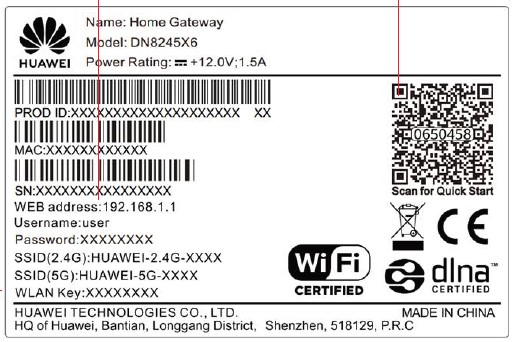

# 2.4GHz Wi-Fi Network

TankMate WiFi sensors can only connect to a 2.4GHz WiFi network. Most modern routers have the ability to broadcast in 2.4GHz and 5GHz.&#x20;

### Option 1: Dedicated 2.4GHz Network

Some WiFi networks will have two different SSIDs:

* MyWiFiNetwork (likely a 2.4GHz network) **->** **use this one!**
* MyWiFiNetwork**\_5g** (likely a 5GHz network)

### Option 2: Combined 2.4 / 5GHz Network

This is common for newer routers. In this case you will only be able to see **one SSID**, e.g.

* MyWiFiNetwork


When only **one SSID** is shown - this will most likely be **capable** of running 2.4 / 5GHz simultaneosly, and should be suitable for use with a TankMate sensor.

However, if you experience issues connecting - see tips below to **check that the 2.4GHz radio is enabled.**&#x20;


### **Check that the 2.4GHz radio is enabled**

Access your **router's admin panel** to check the setting for your wireless network

* Look at the **label on the back** of your router. This should display the **address**, **user name** and **password** used to log in to your router settings
* e.g. a [Spark Smart Modem](https://www.spark.co.nz/help/internet/broadband-help/spark-smart-modem-support/log-into-modem/) would use: 192.168.1.254; admin; admin
* From your PC:
  * Open any **web browser** such as Chrome, Firefox, Edge
  * In the address bar, type in the **router address** (e.g. 192.168.1.254) and press enter
* Under your wireless network settings (**WLAN**) - check that the **2.4GHz option** has been turned on&#x20;
