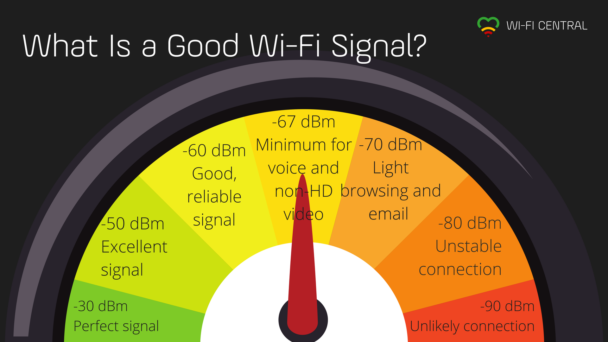
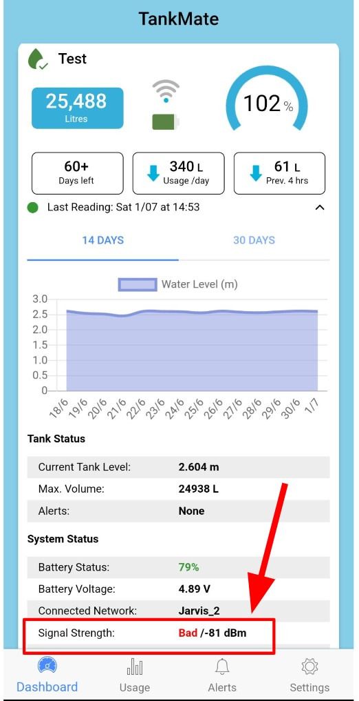

# Intermittent Data Issue - WiFi

If your sensor is only sending data intermittently, and missing scheduled data sends, the issue **could be related to your WiFi signal strength**. You can check the signal strength of your TankMate unit (last known connection only) on the expanded dashboard screen of the app - see screenshot at the bottom of this page.

A received signal strength (RSSI) **greater than -70dBm** is usually good enough for a stable connection to TankMate sensor.

<figure><figcaption></figcaption></figure>


If the received signal strength is in the range of **-80** to **-85 dBm**, you will likely have issues sending data reliably. &#x20;


## How to test an intermittent WiFi connection issue:

Take a few **test readings at the tank** - to see if it connects consistently - 3 or 4 times in a row. Press the **RESET button** (short press only - don't hold it down):

* If the LED blinks green, then **turns solid blue** for around 5 seconds => device **connected OK**
* If the LED blinks green, then **blinks red**  => device **failed connection**

To confirm if the **signal strength** is causing failed connections, **remove the sensor** from the tank and **bring the unit closer to the router:**

* Increase the **reading frequency to 4 times / day** (in the app - on the settings screen)
* Take a **test reading -** press the RESET button (short press only - don't hold it down)
* Check the new **RSSI value** (swipe down to refresh the app)
* Check the app - to see if you are getting more regular readings **over the next few days**


### How can I improve the WiFi signal strength at my tank?

There is only so much you can do - without changing any of your network hardware (router / access points), but you can try:

* adjust the **position of the router**, to try and to reduce interference from surrounding objects
* performing a **hard reset** of the router (power cycle)
* **removing any foilage** that may be obstructing the WiFi signal at the tank



**TIP**: setting the **publishing frequency** to **more than once per day** would be helpful. That way, if it misses the odd connection, you will still get reasonable data frequency


<figure><figcaption>
Check the last known RSSI value for your sensor 
</figcaption></figure>
