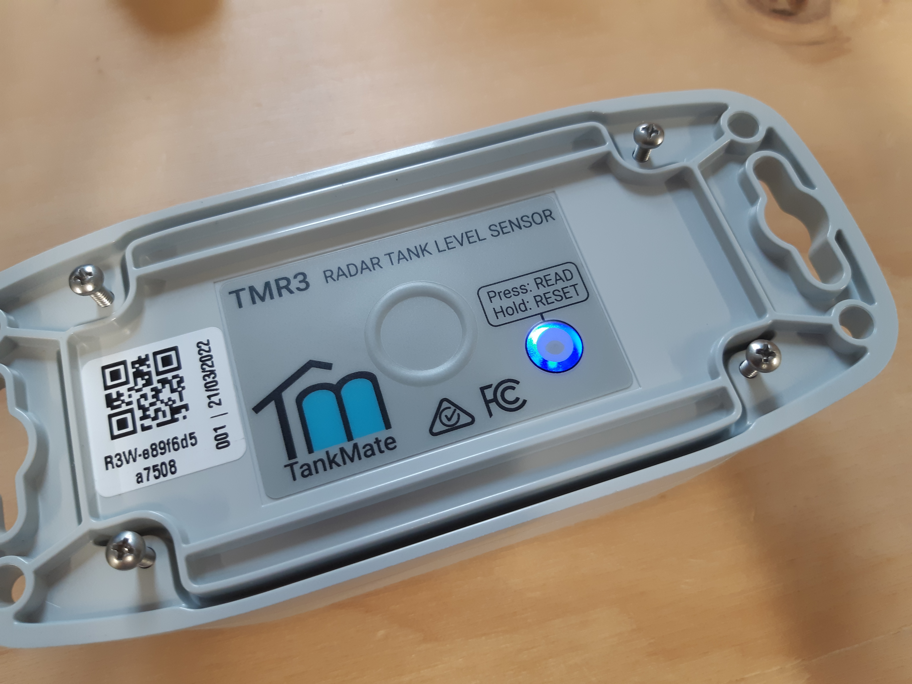

# Reconnect - R3 WiFi Level Sensor


First, check that your sensor is not already connected! Press the **RESET button once** (short press) and watch the **status LED**. If you see a **solid BLUE (cyan)** colour for **5-10 seconds**, the unit is already **connected** to a Wi-Fi network. 


### Reconnect a sensor using BlueConnect

* In the TankMate app, go to **Settings** > **Sensor / Tank Settings** > **Edit Network Settings**
* Put the sensor into BlueConnect mode - unscrew the sensor from the tank. Turn the sender unit upside down, and hold the **RESET** button for **6-8 seconds** then release.
* The status LED will **blink slowly** - **dark blue** - when in BluConnect mode 
* The unit will go to sleep to conserve power after 3 mins. Click RESET again to wake it up if required
* Follow the prompts in the app to scan and connect to the sensor. Ensure the status light on the sensor is still blinking. Select the TankMate device, and proceed to the network SSID and password page


**NOTE:** WiFi passwords that include the **$ symbol** are not currently supported by some olderTankMate sensors. We recommend modifying the password, or setting up a guest network with a different password.



For a more detailed outline of the BlueConnect process - [see here ](using-bluconnect.md)


