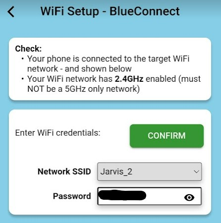

# Using BluConnect


Your phone must have **Bluetooth turned ON**, as well as [**Location Services!**](enabling-location-services.md)\
**Your WiFi network must** have [**2.4GHz enabled**](2.4ghz-wi-fi-network.md)**.**



To edit the WiFi connection of an **existing** sensor:

* In the TankMate **mobile app**, go to **Settings** > **Sensor / Tank Settings**
* Select "**Edit Network Settings**" - from the Sensor Settings section


* Make sure your sensor is in the correct mode for BluConnect - see details for [v2 sensors here](reconnect-v2-wi-fi-level-sensor.md), or [R3 sensors here](reconnect-r3-wi-fi-level-sensor.md)
* On the BluConnect screen - press the button to **"Initiate Bluetooth Connection".** This will create a temporary bluetooth connection between the phone and the sensor, to allow the phone to send the WiFi credentials to the sensor.&#x20;

<figure><figcaption></figcaption></figure>


**TIPS:**

* You do **NOT** need to search for, or pair the sensor as a bluetooth device **outside of the TankMate app**. It must be done from **within the app**, on the BluConnect screen. If you have paired the sensor on your phone's Bluetooth devices screen - unpair / forget the device before continuing.
* If you are having **difficulty finding the sensor** - turn Bluetooth (on your phone settings) **OFF** and then back **ON**. Further [troubleshooting tips below](using-bluconnect.md#troubleshooting-bluconnect).
* The **sensor** should be **within a few metres of your mobile phone** - to ensure the temporary bluetooth connection is in range
* **iPads** can have issues with this process! Use a mobile phone instead.


On the next screen:

* select the name of your **WiFi network** and **enter the password**
* Ensure **the sensor is still blinking blue slowly**&#x20;
* Press "**CONFIRM**" to send your network details to the sensor

<figure><figcaption></figcaption></figure>


If you **can't see any SSID** options listed, check the following:

1. You are **connected** to the target **WiFi network**
2. You have **enabled Location Services** for the TankMate app. [See here for details](enabling-location-services.md)


A **success message** should be displayed in the app after 5-10 seconds. The **LED** on the sensor will turn a **solid light blue** (cyan) colour for **5-10 seconds** after a successful connection.&#x20;

### Troubleshooting BluConnect

#### Error Messages after sending your SSID / password

* Incorrect password - check your WiFi network password
* Network error. TankMate sensors can only connect to **2.4GHz** networks. Combined 2.4 / 5GHz networks are also supported. Check your network details. [Further WiFi tips can be found here](check-connectivity-v2-and-r3w-wifi-sensors.md).


**NOTE:** WiFi passwords that include the **$ symbol** are not currently supported by TankMate sensors. We recommend modifying the password, or setting up a guest network with a different password.


#### I cannot see any device listed when I scan using the BluConnect screen

* Ensure Bluetooth is turned on. If it is, try turn Bluetooth OFF and then back ON. Exit the BluConnect screen and come back in if the issue persists.
* Check that [**location services**](enabling-location-services.md) are turned on
* Don't use an **iPad**! These are not always compatible with our Bluetooth (BLE) protocols
* Make sure you are **close to the sensor** (1-3 metres)
* Check that the **sensor** is in the **correct mode** for BluConnect - see details for [v2 sensors here](reconnect-v2-wi-fi-level-sensor.md), or [R3 sensors here](reconnect-r3-wi-fi-level-sensor.md)

#### The app is stuck spinning after I send the SSID / password

* Check that you are **close to the sensor** while completing this process. The temporary Blutooth connection only has a range of a few metres
* Ensure **the sensor is still blinking** (Blue or Purple, depending on model) **when the network details are sent to the phone**. If not - press the RESET button once (to wake it up) before pressing "CONFIRM".
